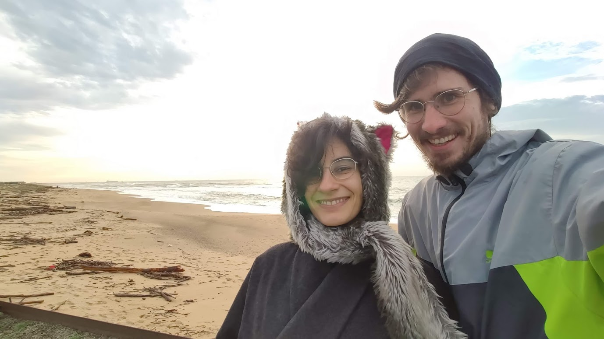
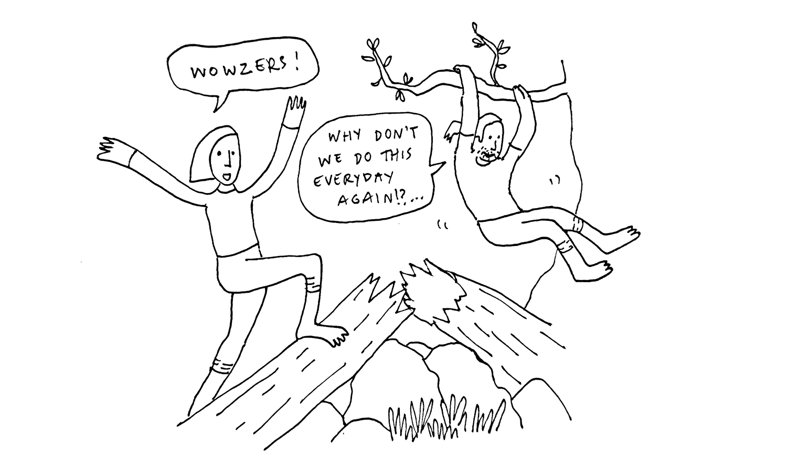

# About

Hello there, wonderful human 👋

We're Silvia and Michal. We live in a small island in the [Azores](https://goo.gl/maps/LiZz2dd2TRfrMqVA8) where we are [building a community](https://app.gitbook.com/@heymichal/s/pico/congregation), learning how to live more sustainably, running an online business where we help people [be consistent with important life practices](https://beta.thewhitelog.com/projects/year-of-practice), and having lots of fun playing in the forest and swimming in the ocean.

**The White Log is the place where we're documenting how we do all of this,** and sharing resources and inspiration to help you live your own version of a meaningful life.

### If you want regular updates and more information, join our newsletter 💌

We have a newsletter where we share ideas and experiments on community building, alternative business models, authentic relating, personal development, sustainable living, mindful productivity, and occasional cute pictures of our cat Kiki. You can[ subscribe here](https://honeyboom-llp.ck.page/03af8bbee7).

### Why we started this project

A long while ago we realized that living a “traditional” life doesn’t satisfy us anymore, so we started exploring and asking ourselves many questions:

* How can we do business in a way that’s focused primarily on having a **positive impact** [rather than making tons of money](https://beta.thewhitelog.com/notes/less-money-more-freedom)? 
* How can we leave the city life to **be** **closer to nature** and start growing our own food? 
* How can we **weave** **healthy communities**, both physically and online? 
* How can we **cultivate authentic, loving, constructive relationships** with ourselves and with others? 
* How can we **make life more playful and creative**?

Not only have we asked ourselves these questions \(and many more\), but **we actually started living the answers and documenting the process so that others can learn from our experience and create their own unique solutions.**

That's how The White Log came to be. You can think of it as a:

* digital garden
* collection of notes and blueprints
* documentation
* digital journal
* blog
* meta reflection
* an actual log

This is an everchanging project, and it will evolve as we grow and learn better ways to live and create. We're always open to suggestions, words of encouragement, and making friends, so feel free to [reach out](contact.md)!

### **What's Next?**

You choose:













Thank you for being here 🙏.

