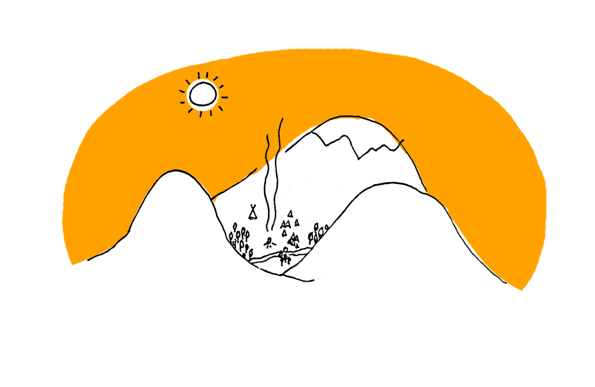
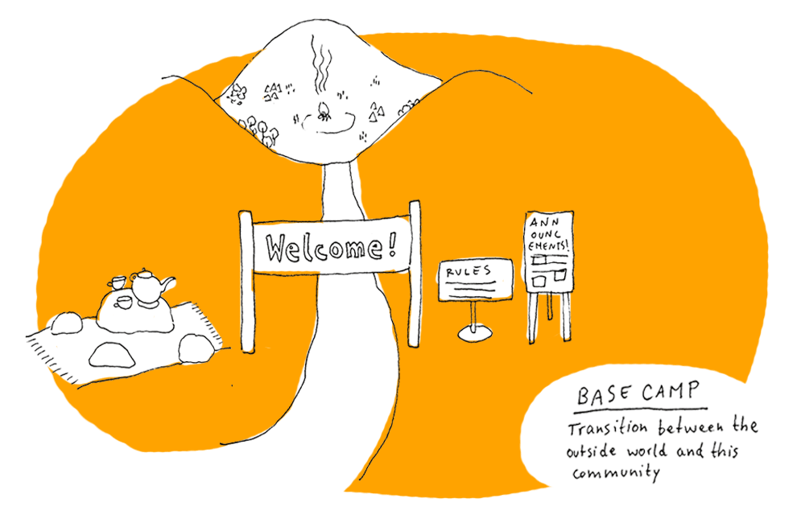
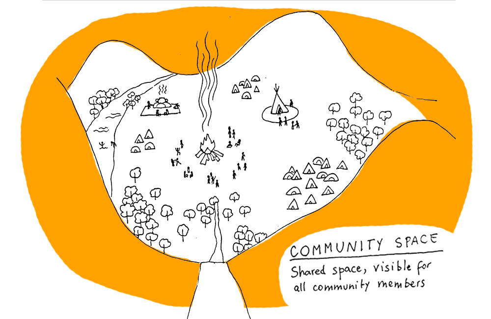
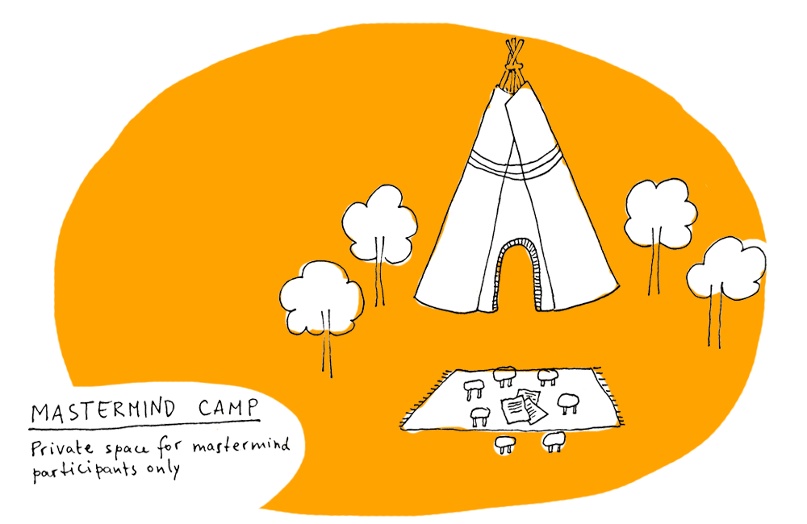

# Building an Online Community of Practice with Discord

[Discord](https://discord.com) is the main tool for our online community to connect. We also use it for all of our cohort-based courses \(such as [Year of Practice](../projects/year-of-practice.md), [Habit Sprint](../projects/habit-sprint.md), [Minimalist Journaling System](../projects/minimalist-journaling-system.md), and more\). 

### Why Discord?

We've decided to go with Discord, because it's **free, extremely versatile, and has some incredible functionality** built in \(such as video calls up to 20 people directly in the app which is a great alternative / backup for Zoom\). 

We also considered other options, but none was the right fit for us:

* The free version of [Slack](https://slack.com/) deletes messages older than 10k most recent ones, and we want to keep an archive of past projects and conversations.
* We find [Mighty Networks](https://www.mightynetworks.com/) confusing to navigate.
* We were looking into [Circle](https://circle.so/) for a while, but the significant price difference \(free vs $79 per month for pro version\) would force us to make more money just to sustain the platform, which [makes no sense for us](less-money-more-freedom.md). And while Circle might be getting all the hype recently, **the truth is that you can build a thriving digital community with any tool.**

### The Initial Setup

The idea of creating a community has been sparked from the need for more connection between participants of our courses, who wanted to interact with each other between the live workshops.

We were lucky to get some relational thinking time with [Uli](https://twitter.com/SchurUlrich) \(a professional digital community manager\), who helped us to create the first version of our server, and agreed to stay as a moderator. Thank you so much for this!

In practical terms, we created a couple of shared documents with:

* Structure of our categories and channels
* Roles and permissions \(who has access to what\)
* Copy for the introduction, including community guidelines
* Simple Discord manual for non-technical people
* A log \(hehe\) where we document the changes as we go along \(because we love to iterate\).

Here's how we structured our Discord:

* An open space visible to everyone in our community
* Private spaces dedicated for participants of specific cohorts of our courses

We also decided to give our digital community a bit of a campfire vibe, inspired by _Rainbow Gatherings:_

When the server was ready, we invited our first 5 members and started experimenting.

### Community Development

Our community is still in an exploratory phase. 

At the moment, **we're experimenting with channels to find the right combination of spaces for our members to connect**. The main challenge is that everyone has different preferences. Some people want to share links, others get overwhelm with that. Some people like long messages, others would rather keep it short and fast. And most of all, some people participate a lot, while some engage only every few days, weeks or barely ever \(which is always the case for online communities according to the [90-9-1 rule](https://www.nngroup.com/articles/participation-inequality/)\).

At the moment we're experimenting with two main types of channels:

* channels prompting a specific type of interaction \(eg. \#introductions \(with a prompt\), \#show-me \(where anyone can ask to share something visual, eg. photo of the view from your window\), etc.\)
* channels based around a topic, aligned with the categories in this very gitbook.

It feels a bit messy, but it's something that we're learning to accept. **No creative process is neat and clean.** And when it comes to doing things together, it always takes time for the group to find the best way of being together.

### Ideas to play with

* [ ] The categories still don't feel right – let it percolate and iterate
* [ ] Host another retrospective session open to members of our community

