# Entrepreneurial Timeline


TLDR with our key insights:  
You won't get it right from the beginning  and that's okay. Build in public. Focus on ONE thing at a time. Ship often, review and Iterate based on what you learn. Create a good opt-in and grow your email list. Build relationships. Be patient, it takes time. Have fun in the process. 


### ⭐️ The Decision

It's June 2017. 

Michal just spent a month [between fire and water](https://www.youtube.com/watch?v=SVeygd_Skfk), and Silvia just came back from her solo trip to Thailand. We reconnect on a sailing trip and shortly after **we** **decide to become location independent entrepreneurs**.

We know what we want:

* work for ourselves \(no bosses please\)
* flexibility to travel anywhere and anytime we want
* feel in alignment with our values
* contribute to a world where all beings can thrive
* financial freedom
* fun

**We have no business experience whatsoever**, but a lot of enthusiasm and we dive straight into the entrepreneurial world.

### First Steps \(Lisbon, Summer 2017\)

After binging on [_4-Hour Work Week_](https://uk.bookshop.org/a/5979/9780091929114) __and Benjamin Hardy's [articles](https://medium.com/@benjaminhardy), we feel like everything is possible. Silvia wants to write. She publishes a few articles on [Medium](https://silviabastos.medium.com/) and starts a blog called _Experimental Connections_. 

Here's one of the very first published articles. It already has Silvia's distinctive style, combining text with beautiful illustrations ⤵



In the meantime Michal is getting happily lost in researching productivity tools, technical details of blogging, as well as deliberations on the optimal structure for our business and tax residency. There's a lot to figure out, but we're having a great time and enjoy the Portuguese summer.

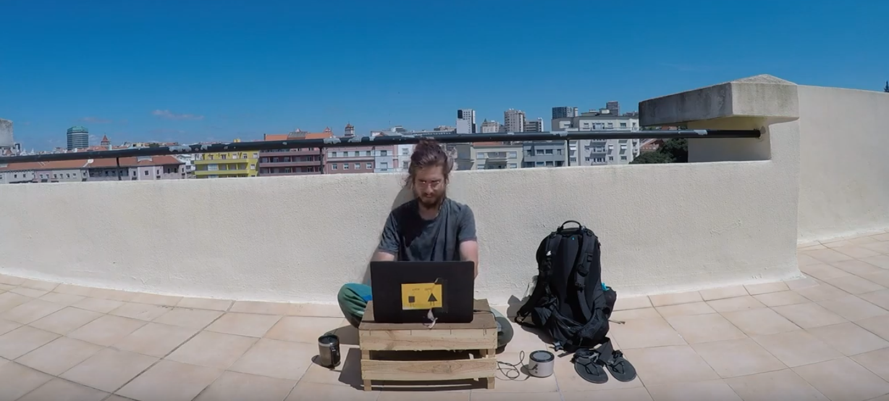

At least one thing is clear: **we're going to be working within the niche of personal development, with a focus on relationships.** It's what we're enjoy, what we're good at, and what people want. It feels like a perfect combination.

We also create our first business plan \(I should find it, because it's totally hilarious\), and a log  where we write 1 text about relationship and 1 about business per person per day. Max 120 characters \(including spaces\). I'm going to [share it with you](https://docs.google.com/document/d/1aM23c-Yf9UEGrjbtvyPd2_Pg9IJM1BmEq6C_bpMDHbs/edit?usp=sharing), because it's quite cute, and we didn't keep it up for too long.

### It's Product Time, Baby! \(Porto / Marco de Canaveses, September 2017\)

We move to the North of Portugal and juggle our time between Porto and a farm in the countryside. We want to find a way to start bringing income \(Medium brings tiny bit of money, but it's close to nothing\) and decide to get help from _Anton Stroboshark_, a toy shark that Michal used to travel with from 2011. 

Anton has an existing audience around his [facebook page](https://www.facebook.com/stroboshark) with shit-tone of amazing photos, which is a great place to start. 

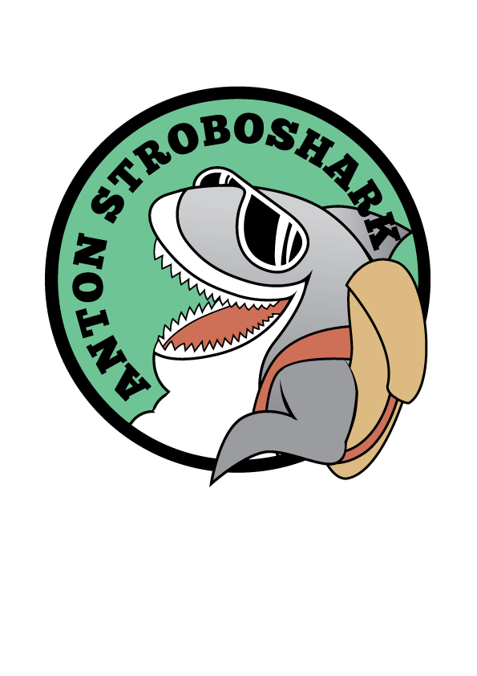

We do some rebranding, create an [Instagram page](https://www.instagram.com/stroboshark), start a comic strip and **launch our very first product: an e-book called "**[**Make Friends Traveling**](https://drive.google.com/file/d/0B7W6vBKSjgx7RnBoYkJkbjBiX2s/view?usp=sharing)**".** We create our first sales page with [HTML5UP](https://html5up.net/), host it on[ github](https://github.com), and [price](pricing-models.md) it as "name your price". **The launch has zero interest and brings zero money**. Oh well. We learn some important lessons and have a lot of fun.

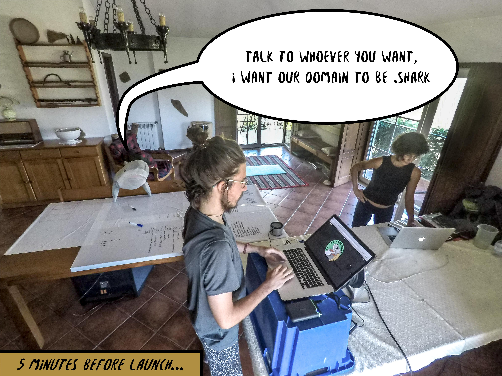

### ⭐️ Things Get Real \(Edinburgh, November 2017\)

**We define our niche as couples traveling and working together.** We have spent a lot of time intentionally working on our relationship and we keep getting feedback from our friends that our experience and approach has been immensely helpful to them. We are also in a healthy, open, polyamorous relationship, which adds additional layer to share about.

We put the pieces together and decide to **create our brand:** _**Honeyboom**_**, where we're sharing tools for vibrant relationship.**

After a long period of deliberation, **we decide to register our business as a** [_**Limited Liability Partnership**_](https://www.investopedia.com/articles/investing/090214/limited-liability-partnership-llp-basics.asp) **in Scotland**, which has been our home for many years. We go to Edinburgh, and come back with an official certificate bringing Honeyboom LLP to life.

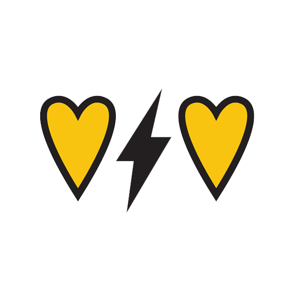

### Experiments In The Capital of Digital Nomads \(Chiang Mai, Winter 2020/2021\)

We pack our minimalist backpacks and fly to Thailand. We try Durian for the first time and nothing is ever the same.

Following the advice from a marketing expert and a friend, [Michal Rejman](https://www.linkedin.com/in/michalrejman/), **we decide to launch a** [**youtube channel**](https://www.youtube.com/channel/UCFkEEtX7yPtYD0Om0GPwL7w). It seems like a good use of the skills we graduated with \(graphic design and film-making\), plus we're being told over and over again that we have a very nice presence that looks cool on video. We take a random youtube creation course on [Udemy](https://www.udemy.com/) and commit to publishing 2 videos per week.

We're still quite fond of our first video:



In the meantime, **we also create a** [**website**](https://honeyboom.xyz/) \(coded in [Jekyll](https://jekyllrb.com/), hosted on [GitHub](https://github.com)\), linking to our articles published on Medium and videos on youtube. Silvia keeps honing her writing skill, and Michal publishes his first [articles](https://medium.com/@michal.korzonek), mostly experimental stuff.



Being in Thailand is life changing. 

We're surrounded by amazing people and learn from their experiences of becoming digital nomads. Our bodies and relationship also level up at an unprecedented rate. Before leaving, **we get the opportunity to have a conversation with** [**Conor and Brittany**](https://conorandbrittany.com/), a couple of beautiful humans and amazing creators, who inspired us to open our relationship. **The video published on their channel brings us a significant spike in subscribers**. Here it is, if you're curious about our relationship story ⤵️



We also **start our email list** using [ConvertKit](https://app.convertkit.com/referrals/l/394dc49b-7c8e-433c-99fe-d9e153831901) and **launch our coaching services:** life coaching and relationship coaching. We don't have coaching qualifications, but we have a decade of experience in facilitating teams, 3 years of 1:1 work with vulnerable people, and a few years of engaging in personal development experiments. It seems safe enough to try. We offer our coaching for free at first, and quickly realise that we're naturally good at it. We create our paid offer, but \(surprise, surprise\) have no clients.

Why?

Well, **our marketing sucks**. Our audience is tiny. Our email opt-in is no good. Our offer is too broad and unclear. But of course, I'm saying that in hindsight.

### Planting the Seed \(Koh Pha-ngan, Spring 2018\)

We're living the digital nomad life, that we have seen on Insta a few years back.

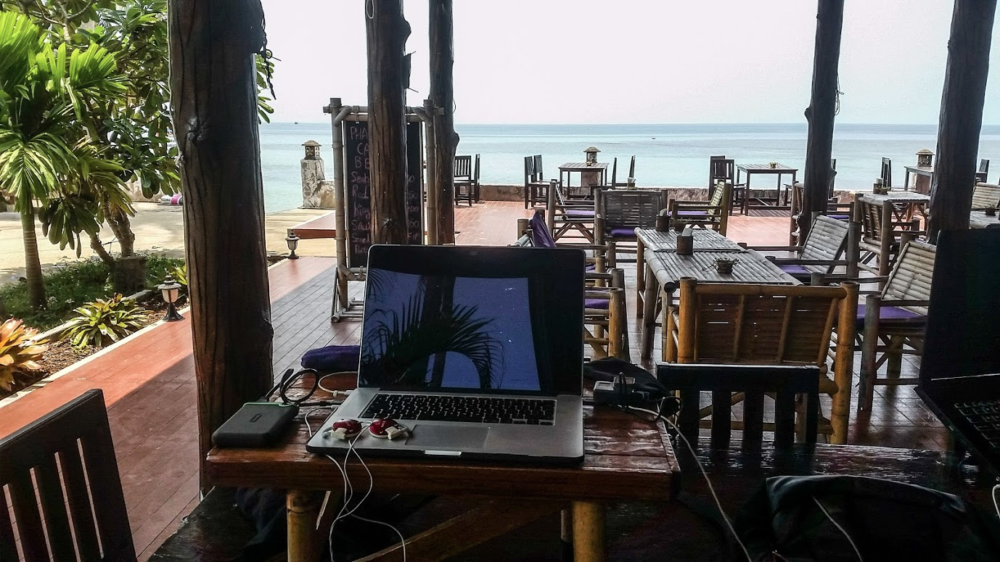

But it's not all roses.

**We keep making youtube videos, but not making any money.** While the videos seem valuable \(according to the comments\), the number of subscribers is growing painfully slow. Our writing on Medium generates some cash, but it's very little. Coaching brings nothing. Our savings are drying up. We know that we need to change something, but we're not sure what and how. And we don't have time to stop and reflect, because the video production takes a lot of our time.

One day, Silvia peaks over Michal's shoulder and notices a page full of squares:

It's a journaling tool that Michal created back in August 2017, designed for life-tracking, habit building and consistency building. Silvia suggest that it's a great topic for an article, and after a long and painful writing process **Michal publishes his first "serious" article**:



And the article actually takes off.

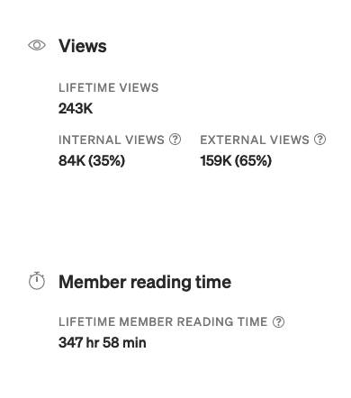

People start commenting, reaching out, asking questions, starting to play around with the "squares", and suggesting to build apps. Funny story though: **we have nowhere to lead people to, so we don't even gain subscribers on our email list.** Another lesson learned.

We also notice something about ourselves: we both use our journals extensively and have a variety of tools we're constantly experimenting with. We don't realise it yet, but the seed for our first "proper" blog is planted.

### New Beginning \(Japan, Spring 2018\)

We move to Japan.

What a joy. We have a total blast.

We spend most of our time in [Dana Village](https://www.facebook.com/DanaVillageJapan/) and **co-host retreats**, bringing deep connection, authentic relating, non-violent communication, and playful movement. This is the kind of work we want to be doing.

And our business is changing, too. We know that we need to shift, and we dedicate more time to figuring out how exactly we should do it.

We drop the pace to publishing 1 video per week and introduce vlogs, which are much more fun to make. 



If you want more, [this one](https://www.youtube.com/watch?v=w-iD0W3LmVw&feature=youtu.be) is a bit longish, but goes deeper.

We also decide to host our first independent retreat in September. Spoiler alert: we don't sell any spaces for it. Our audience is too small, and our marketing way too vague.

But the big changes are coming.

One day **we come across an online course that seems like exactly what we need: a clear path to building a blog bringing regular income.** We enroll in the course, enjoy our last days in Japan, and fly to Scotland.

### The Freedom Machine \(Edinburgh, Summer 2018\)

The course, called the [_Freedom Machine\*_,](https://smartblogger.com/products/) will turn out to be a game-changer for us. But I'm getting ahead of myself.

_\(\* Disclaimer: The course is now offered in an "unsupported" version. We're not sure to what extend that would have worked for us, as we benefited the most from the "live" guidance, but still – the content is great.\)_

For now, **we decide to stop making youtube videos and focus on writing.** And we launch a retreat _\#DeepTalkAnywhere_, focused on building deep connection and targeted for digital nomads. The retreat doesn't take off, but the writing does.



### Finding Our Niche \(France & Poland, Autumn 2018\)

We move through the course and decide to **focus on journaling**, which eventually \(after few months of testing viability of this idea\) leads to launching [JournalSmarter](https://journalsmarter.com).

In the meantime, Michal completes the first annual accounts for our company, which brings him close to burnout \(our tax residency situation is not straightforward, otherwise it would be a piece of cake\). He swears to never do it again, but little does he know that he will do it again next year \(because this time it will be easier, right?\). Spoiler: it sort of was, but not really... Hire a freaking professional.

### ⭐️ Launching JournalSmarter \(Portugal, December 2018\)

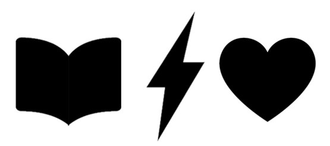

Launching [_JournalSmarter_](https://journalsmarter.com) __feels like a huge milestone in our journey.

We're clear on the format, the topic, and the audience. We don't know exactly how to monetize the blog, but for ow we're focusing entirely on growing the number of subscribers. That's one of the key lessons, that we're finally implementing: **build an audience first. Launching products comes later.**

In the meantime, we keep writing commissioned articles for [Better Humans](https://medium.com/better-humans) and publish on Medium to bring some income. The best part is, that while we're getting paid, we're also growing our own audience. Things start to work.

**We also create our email opt-in. This is a critical part.** Without a good opt-in people don't leave their email and never come back to your site. Ours is a starter kit of the Minimalist Journaling System. We know it sparks curiosity, and we know it's a powerful journaling tool.

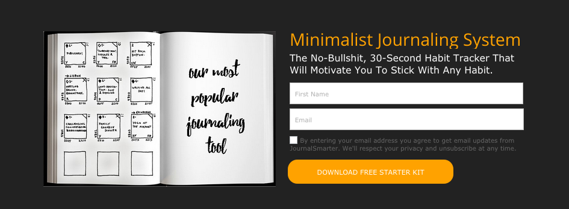

Btw, the thingy above is an image. If you want your copy of the MJS starter kit, you can [get it here](https://journalsmarter.com/minimalist-journaling-system-starter-kit/).

### The Journey to 1000 Subscribers \(Portugal & UK, Spring 2019\)

The plan is to reach our first 1000 email subscribers with up to 6 articles following the strategy from the Freedom Machine. It works.

#### 1. An Ultimate Guide optimized for SEO ⤵️



#### 2. "Curator" Article

Designed for tagging other people's work, so they have an incentive to share with their audiences. **We take it to the next level and design journaling exercises**. It takes a long time, but it's totally worth it. **This article is still one of the articles that brings the most traffic to JournalSmarter,** plus we cross-posted it on Medium, where it exploded. Things are definitely moving ⤵️



#### 3. "Slipstream" Article, designed for social sharing

The illustrations in this one are incredible ⤵️



#### 4. Another Ultimate Guide to boost our SEO



#### 5. "Ego Bait" Article \(the name is really shitty, alternatives, anyone?\)

Similar to the "curator", but instead of referencing people's work you reference them directly. 



#### 6. "Illuminator" Article, explaining a concept in depth

And again, just the illustrations are a piece of art.



**We hit 1000 subscribers mark after our third article.**

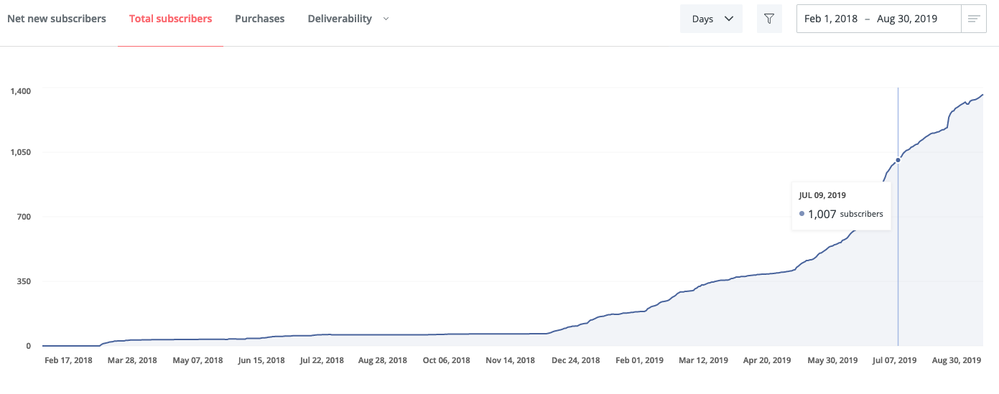

We now have an audience. And Google starts sending us more people. We begin to think about monetizing our blog.

### ⭐️ Discovering Facilitated Online Courses \(Astralship, Summer 2019\)

While living in [Astralship](https://astralship.org) \(which must be one of the coolest places we ever lived in\), we meet [Francesca Pick](https://www.linkedin.com/in/francescapick/) and [Manel Heredero](https://www.linkedin.com/in/manel-heredero/), who are launching their new venture: [_Better Work Together Academy_](https://academy.greaterthan.works/)_._ They introduce us to the awesomeness of facilitated online courses, and we pick it up immediately.

### Live Workshops \(UK, Summer/Autumn 2019\)

We test our course ideas through delivering workshops, both presential and online. We don't have many people, but get excellent feedback helping us to create a solid foundation for our first courses.

### ⭐️ Our First Online Courses \(UK, Poland & Portugal, Autumn 2019 - Spring 2020\)

We launch two courses simultaneously. It allows us to experiment with different approaches to pricing, but it requires more time. In hindsight, we should have focused on one and dedicate the rest of our time to writing articles to bring more subscribers for next iterations.

Both courses are similar: content + 6 bi-weekly calls. Unfortunately, we completely fail to transmit the value of the calls and only a few people show up. But the ones who do, stay with us \(and some of them even until today\). **We can already tell that we have something special in our hands.** We know we are good at holding space and bringing people together. And while we prefer working face-to-face, we're also enjoy doing it online. In fact, we feel like fish in the water 🐠.

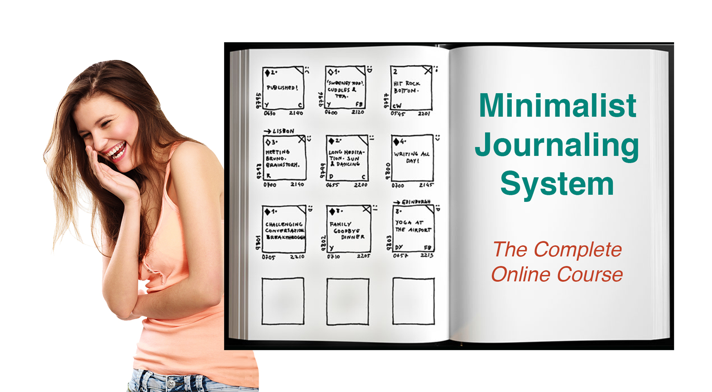

We launch our first iteration of the MJS course for $29. I can't believe that we price it so ridiculously low.

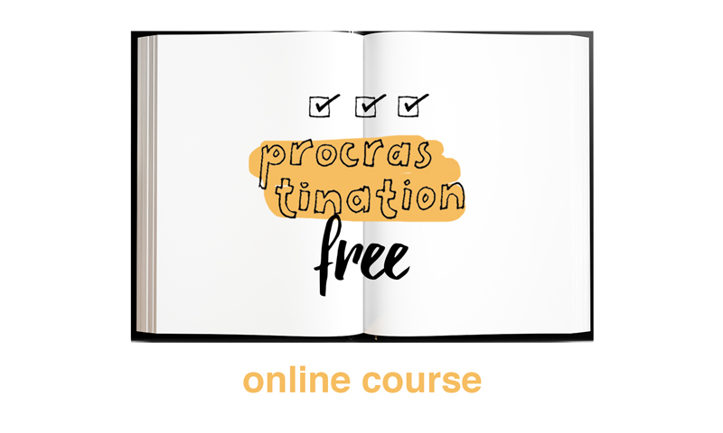

The PRF course comes with a $199 price tag. Funny story: both courses earn pretty much the same amount of money in total.

**This is a massive milestone for us. We created a course, launched it, people bought it, loved it and stayed with us for more. While we didn't earn much, this experience made us believe that it is possible to make a living out of this.**

### Iterating On Our Courses \(Portugal, 2020\)

In the following months we launch a few iterations of our courses, gradually tweaking them to deliver the best possible experience to the students. 

We introduce an asynchronous [community of practice](community-of-practice-with-discord.md) \(with [Discord](https://discord.com)\) and onboarding. We experiment with different [pricing models](pricing-models.md). We redesign our workshops \(hat tip to [_Design and Facilitate Online Workshops_ Course](https://academy.greaterthan.works/p/design-and-facilitate-online-workshops) that helped a lot with that\). We improve the technical back-end and course delivery. We improve our marketing.

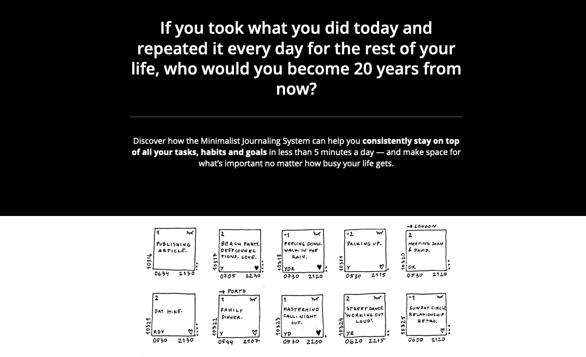

Most importantly, w**e keep honing our skills as facilitators, while delivering enriching experiences for our students, and building a community of practice with amazing people. We love our work and we're good at it.**

* [ ] image A

**We also experience the "launch anxiety"**. We never know if we're going to get enough people to run the course, which is absolutely nerve-wrecking every single time. We're still living "from launch to launch", which brings a lot of pressure – if we fail to fill enough spaces to run the course, we need to cancel the  whole course and refund the money, which puts more pressure on launching another product ASAP, before our cash runs out.

**Marketing is still our biggest bottleneck.**

### ⭐️ Joining Enspiral \(Portugal, August 2020\)

[Enspiral](https://enspiral.com) was on our mind since meeting [Fran](https://www.linkedin.com/in/francescapick/) in [Astralship](https://astralship.org/) back in 2019, but to be honest, we felt that we're not ready. Or, to be frank, we felt like total collaboration n00bs who can't bring much value to the network.

However, the desire to "level up" is there, and we begin experimenting with [microsolidarity](https://microsolidarity.cc) in the early 2020. Within a few months, we gain confidence, and with a gentle push from [Uli](https://twitter.com/SchurUlrich), we decide to find our way in. We join on time to participate in Enspiral Europe Online Gathering in September 2020.

We meet amazing people and get exposed to ideas, practices and new ways of organizing, which help us clarify what we want to do, and how we want to do it.

### The 6-Figure Website Course \(Portugal, September 2020\)

We take the bull by the horns. Marketing is our biggest bottleneck, so we enroll in a marketing course from [Peter Sandeen](https://petersandeen.com/). The introduction module make us realise that **we have a deep problem in the foundation of our business: we're not absolutely clear on what our offer is, which is connected to the fact that we want to be sharing about much more than just journaling.**

We decide to go through the course twice: first, to create another iteration of JournalSmarter, so we can improve our current work and learn the new marketing framework. Second, to create the next iteration of our business, which will be something different than JournalSmarter.

The course helps us to redesign our [JournalSmarter website](https://journalsmarter.com), launch v3 of the [Minimalist Journaling System](../projects/minimalist-journaling-system.md) course, [Year of Practice](../projects/year-of-practice.md), and creates a fertile environment in which we'll eventually come up with The White Log.

### ⭐️ Launching Year of Practice \(Portugal, December 2020\)

Based on what we learned from our previous courses and the 6-Figure Website Course, we come up with an idea of **a year long habit building course**. We're not sure if that's total madness, so we ask for feedback. People seem to enjoy the concept, so we decide to launch the [Year of Practice](../projects/year-of-practice.md).

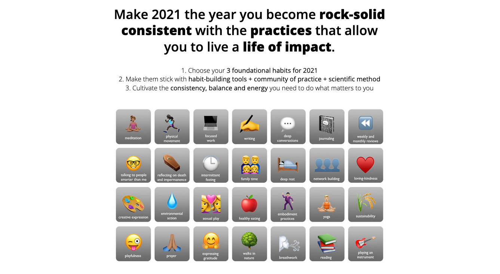

And it works. It's the first time that we sell all the spots \(20\) for the cohort.

Interestingly this is **one of the fastest product to ship.** We were super clear on what we want to do and having the experience of running successful facilitated courses before made us confident that we can create an amazing experience for people.

We also find that **building relationships is indeed the most effective way of bringing amazing participants into our courses**. We're forever grateful for our friends and past students who shared our work in their social channels:



**Year of Practice is a total game-changer. With one product we cover most of our** [**basic financial needs**](less-money-more-freedom.md)**, which brings us a sense of space and freedom, which we haven't experienced since the start of our entrepreneurial journey.** We can now focus on delivering amazing experience for the participants, as well as creating more amazing content without so much pressure on selling more products.

The spaciousness makes all the difference to our work in 2021, and allows to bring The White Log into fruition.

### ⭐️ Launching The White Log \(March 2021\)

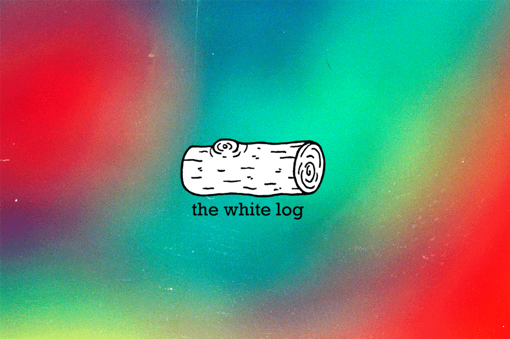

After a few months of deliberation, **we decide to shift the direction of our business and launch The White Log**. We begin with publishing a _beta_ version with [GitBook](https://gitbook.com) to make it super easy to ship without getting stuck in perfectionism.

**The White Log solves a few foundamental problems** we have been struggling with for a few months:

* We loved [JournalSmarter](../projects/journalsmarter.md), but felt limited by the brand, as **we wanted to create content not only related to journaling.**
* **We were confused about the structure of our content, since we had a few different pieces here and there** \(such as our personal newsletters, JournalSmarter, writing on Medium, small documentation projects etc.\). The White Log serves as our "umbrella", compiling everything that we create into one place. It is also an experiment helping us to build in public and discover the optimal way to structure our business by doing it in iterations.
* **We felt drained by the pressure connected to basing our income on launching courses.** **We decided to shift towards gift economy and launch a Patreon to support our work.**



Our long-term goal is to open-source most \(or all\) of our work, and rely on gift economy, but we understand that this requires time. For now our business model relies on the base coming in from the Year of Practice, and launching a few more courses throughout the year to bring more income that the very minimum. And in the meantime we'd like to build a substantial base of Patrons.

Goals:

* [ ] The Magic Five \(5 Patrons\)
* [ ] It's Happening \(25 Patrons\)
* [ ] This is Huge \(50 Patrons\)
* [ ] Wow! \(100 Patrons\)

_We'll keep updating the dates when we reach the goals above._

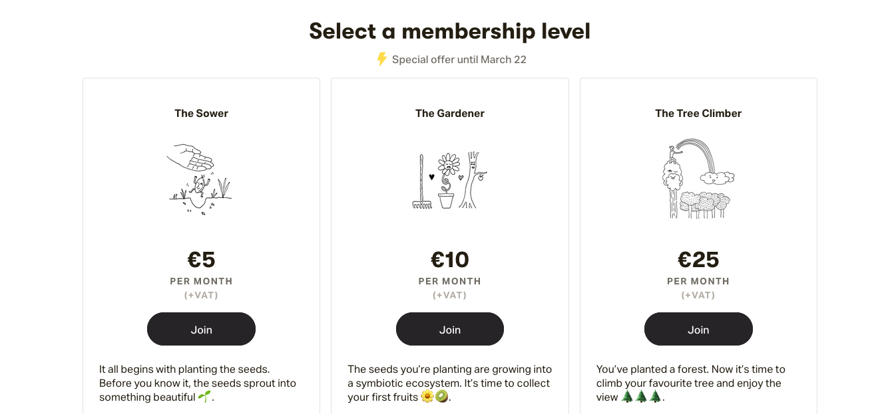

Technical note: The sub-optimal part was launching The White Log and our Patreon almost simultaneously with our [Habit Sprint](../projects/habit-sprint.md) \(HBS\), which forced us to prioritize. We decided to focus on marketing HBS first as it was time sensitive, and move on to promoting The Log later on.

* [ ] Add a post about why did we choose Patreon

### Launching Habit Sprint \(March 2021\)

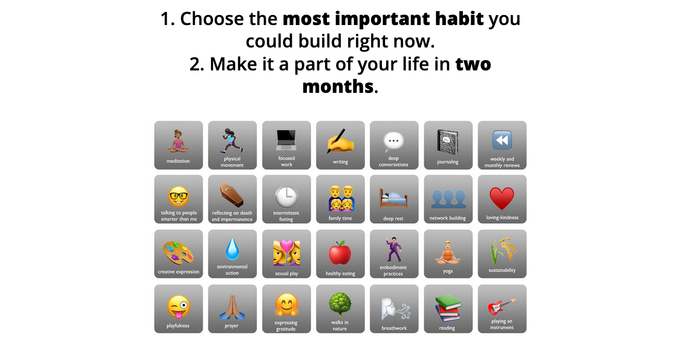

Based on the success of [Year of Practice](../projects/year-of-practice.md), we decided to launch a shorter version with a few improvements:

* Added private chat coaching as a feature. We included it in the Year of Practice as a bonus to test if it works, and it far exceeded expectations, so we made it an itegral feature of the Habit Sprint.
* Added private offboarding to ensure smooth transition after the course is over.

You can see more documentation here ⤵️



\*\*\*

And that brings us to today. Thanks for reading so far. You can [**join our journey here**](https://honeyboom-llp.ck.page/03af8bbee7). And if you feel a call to [**support us**](../support.md), we definitely won't say _no_. 💛

