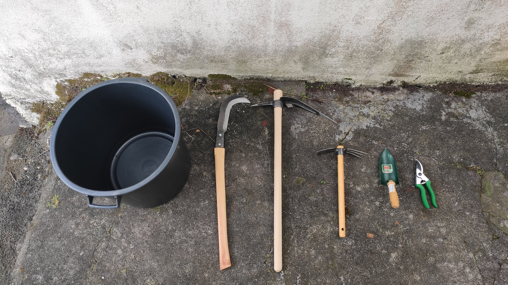

# Farming 101 🌾

I'm the guy who used to fail to keep cactus plants alive. So yeah, if I can grow my own food, then anybody can.

### Farm Design

It all starts with a plan. 

* Draw an initial map of the farm
* Transfer it to a millimeter paper
* Arrange components of the farm

Below are the components of our farm.

#### Nursery

#### Raised Beds

#### Compost

### Farming Calendar

Knowing when to plant stuff is key. We're creating a [farming calendar](https://airtable.com/shrg1IXFIVeMwJHiv) as we go.

### Farming Tools

Here's a set of basic farming tools for Pico:

### Food Production Cycle

