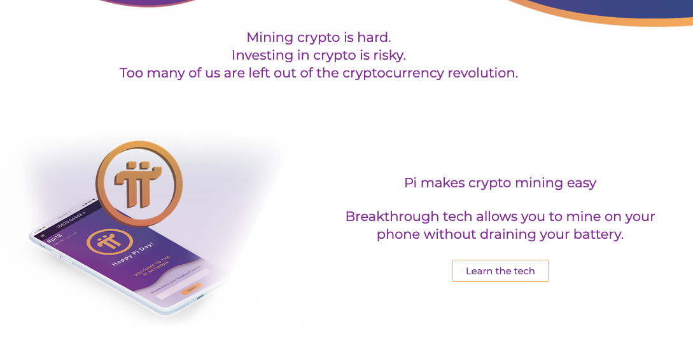
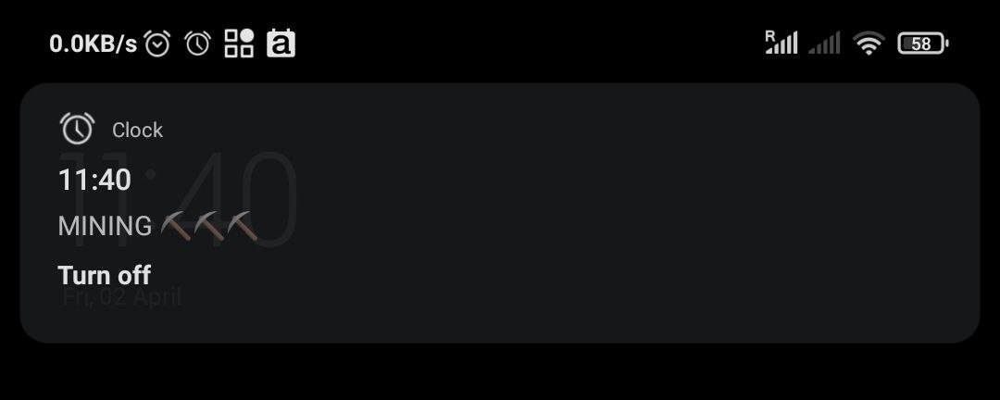

# First Experience With Crypto

I've been feeling more attracted to cryptocurrencies recently, but I have two main problems preventing me from jumping on the wagon:

1. I am a total crypto noob and it the whole world of cryptocurrencies seems super technical and overwhelming.
2. I have no money to invest, knowing that I can loose it all. My priority is to buy a tiny piece of forest in the island where I live.

And the problem two kinda makes it pointless to invest time and energy into learning more about it. So while I felt a pull, I thought that I'm just not bound to explore it for the foreseeable future. And that's when a trusted friend sent me one Pi.

### My Very First Crypto Experience

Pi is a new cryptocurrency designed with people like me in mind ⤵️

Here's my understanding of it:

The coin is now in an early phase and without monetary value \(yet\), which means that **you can acquire it for free, via "mining", which in practical terms means clicking a button inside the app every 24 hours.** Btw, mining doesn't require the app to be open, drain the battery, or, from what I understand, it doesn't have a big negative impact on the environment like Bitcoin. So far, so good!

I've set a daily alarm to ping me at 11:40 to do some mining ⛏. It always makes me laugh.

The amount of Pi you can mine decreases with the amount of people joining to protect the scarcity of the coin. Eventually it will drop to zero. I guess I'm an "early adopter", hehe.

Pi has a great built-in sharing mechanism, creating win-win incentives for people within the network and new participants: faster mining and extra coins. It's a common strategy, and it works – my friend shared it with me, and I shared it further. Why not?

Basically, **I click one button per day, and if things go well, I might get wealth in the future.** And if not, I've wasted 5 sec per day, which doesn't feel like a big risk. Let's see how it goes 🌱.

If you'd like to join, here's a win-win [invite link](https://minepi.com/heymichal) \(use _heymichal_ as your invitation code for a bonus\).

