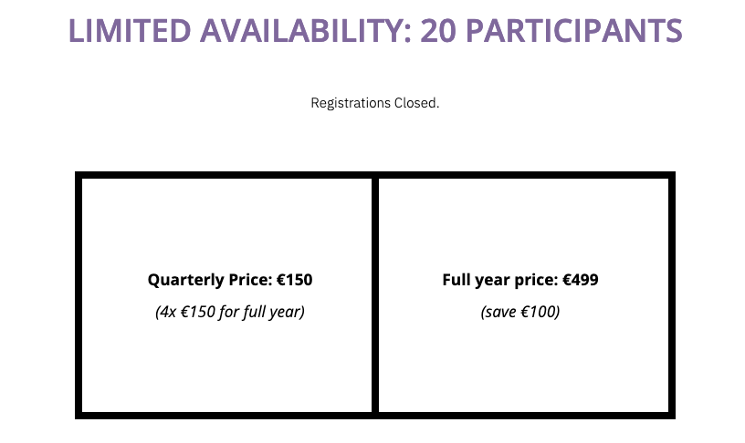

# Less Money, More Freedom

Money is a tricky subject.

The common mantra in business is that "_you need to spend money to make money_", but I'd like to bring a different perspective to the table:

**The less money you need to spend, the more freedom you have.**

Note that this applies to both running a business, and your private expenses. If you need to spend €500 per month on different tools and services allowing you to run a business, then your business is forced to make more money to break even, which creates pressure to make sales. Similarly, if you need to spend €2000 per month on rent, food and other stuff, then you need to get this money from somewhere.

Imagine the freedom that comes with your monthly business expenses staying below €100, and your personal expenses below €500. It doesn't mean that you can't make more money if you need it. But you don't have to make more money.

**This is not about "cutting the costs". Instead it's a mindset shift.**

And don't get me wrong: some expenses are not easy, or not possible at all to reduce. And I personally prefer to buy an amazing tool, service or experience rather than disposable crap. But the question remains – do I really need it in the first place? Can I reuse something I already have? Where would I be able to find an alternative?

You'd be surprised how many viable ideas you can find.

### What is _Enough_?

I kinda wish that I would have read "[The Company of One](the-company-of-one.md)" by Paul Jarvis as I was beinging my entrepreneurial journey.

Here's an idea that shifted how I think about business:

**Profit has diminishing returns for the lifestyle quality. Instead of maximising the profits, define the upper limit on your income, and design your business working backwards from there. And once you hit the limit, relax and enjoy your life instead of working more. Bonus points if you reinvest the surplus into people and projects that are making the world a better place for all beings.**

This is a powerful principle, especially when combined with shifting your mindset towards living with less. If your monthly expenses are below €1000, then €12k covers your costs for an entire year. And how much more money do you really need to be happy? another €10k? A €100k? A €1m?

What is your _enough_?

It's a choice you make.

### This Is How We Do It

Here's an example:

[The Year of Practice](../projects/year-of-practice.md), has been designed with this principle in mind. Instead of optimizing the course for infinite scaling and profit, we ask ourselves: _what is the maximum that we want to earn from this course_? 

With the specific number in mind, we decided to [keep the price affordable](pricing-models.md) \(instead of inflating it to increase the "perceived value", as the popular advice recommends\) and created a limit of participants.

And then the magic happened.

We filled all 20 spaces with _amazing_ people.

Since the course doesn't cost us much to run \(less than €50 per month in tools and software\), pretty much all of the money goes directly to cover our living costs. And our living costs are low: around €1000-€1200 per month for the two of us. 

This feeling of freedom and spaciousness allowed us to focus on delivering an amazing experience for every participant, as well as experiment and create without the pressure to sell more.

As a result, we're working less, creating more \(and better\), and feel like we're embodying our values.

Magic 🧙‍♀️.

