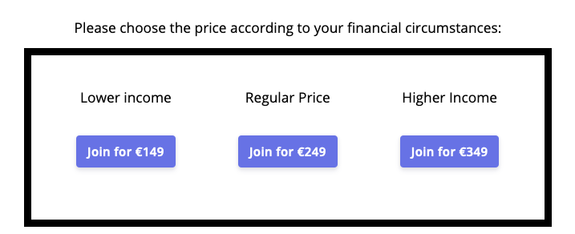

# Alternative Pricing Models

Exploring different approaches to [money in business](less-money-more-freedom.md) propelled us on a way to seek alternative pricing models.

Alternative to what?

### Traditional Pricing

#### Premium Pricing

The most common advice in our entrepreneurial niche is to charge **premium,** with a simple idea in mind: **the higher the price, the higher the perceived value** of the product**.** There's a sound logic to it: high price = less customers needed = more focus on every customer. And you can use the surplus to be more generous and offer discounted/free access to your products, or reinvest the money into a non-profit venture.

But no matter how clever the explanation, this approach doesn't resonate at all with the kind of world we want to be creating. Moving on.

#### Economies of Scale

Let's look at the opposite model: **make it cheap, so it's a no-brainer to buy, and aim for selling A LOT.** This is doesn't necessarily mean pushing people to buy shit – for example, communities usually benefit from more members, so charging a little to join might actually improve the experience of everyone involved, while generating considerable profit. One of my favourite creators, Anne-Laure Le Cunff created an [awesome community](https://nesslabs.com/) with this model.

The problem for us is that you really need to scale to make this model work, and since deep human connection is at the very foundation of our business, we can't really scale it that much, or at least we haven't found a viable way.

### Alternative Pricing

What if we moved away from this binary choice and try something different?

#### Name Your Price \(aka Donation\)

I absolutely love this model. Let the client name their price. It can start at as little as €0 \(or €1\) and there is no upper cap. The beauty of this approach is that it's affordable to anyone, but it also leaves the space for people with high financial means to contribute a lot. Check out this [article](https://medium.com/@tmorkes/pay-what-you-want-the-ultimate-sales-strategy-4030c63c5798) to learn more about this model.

#### Sliding Scale

This is a twist on the Name Your Price model. Instead of open contribution, create a few predefined options. For example "higher income", "regular income" and "lower income". While this model doesn't allow for unlimited generosity \(since there is an upper cap on possible financial contribution\) it makes the process of choosing much more straightforward. We've seen this approach work for [Rich & Nati](https://www.thehum.org/) and we liked it a lot.

We're experimenting with this model for the first time in our [Habit Sprint](../projects/habit-sprint.md).

