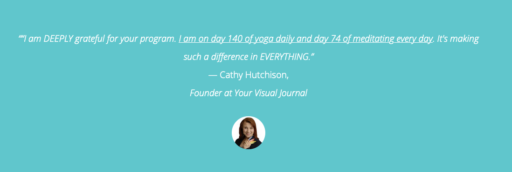

# Habit Sprint




The course is currently ongoing and therefore closed for enrollment. If you want to hear about our facilitated courses, join our [newsletter](../newsletter.md).


### Context

After the success of the [Year of Practice](year-of-practice.md) \(YOP\), we decided to launch a shorter, **2 month version of a powerful cohort-based habit building course**. We're implementing lessons learned from the first quarter of YOP, as the course clearly seems to be working like a charm.

Here's how we make it happen.

### Format

Habit Sprint is a **two-month facilitated habit-building program**, where each participant chooses one habit to focus on. The program combines the following elements:

* Private Onboarding
* Bi-weekly Workshops
* Private Chat Coaching
* Community of Practice
* Extra Workshops
* Private Offboarding

The cohort is limited to 20 people, so everyone can get to know each other, and facilitators can cultivate 1:1 relationships with each participants \(try that in course with 1000 students!\).

After two years of experimentation with facilitated online courses, it seemed like we have found a combination that really works for something as tricky as habit-building. Below is a brief explanation of how we use all these components to create **a course with an unprecedented success rate.**

#### **Private Onboarding**

We first implemented private onboarding calls in the 3rd iteration of the [Minimalist Journaling System Course](minimalist-journaling-system.md). We found it to be a **mission critical element** of our courses, as well as a clear differentiator from most online courses.

**The purpose of the onboarding is to get to start building the connection between the participant and the facilitators**, get to know each other a little bit, and hear about their intentions for the course and answer any questions. This allows us to make tweaks to the program to fit their needs better. We also noticed that **the onboarding all significantly increases the quality of the first workshop**, as the participants feel more relaxed since they already established a relationship with facilitators**.**

#### **Bi-weekly workshops** 

That's the **foundational part of our courses**, bringing [relational growth rhythms](../notes/relational-growth-rhythms.md) to the process. The **workshops are designed for creating deep connection** between participants, and help troubleshoot, rekindle motivation, and find the most effective way forward together. In other words, **we not only deliver the essential content, but also help each participant to adapt it to their own circumstances, while building beautiful relationships.**

The workshops are the most exciting part of the whole course, and one of the key reasons why people keep coming back.

We record the workshops \(apart from the breakout rooms\), as well as keep notes with key insights, which we then share with the group to keep track of our journey and spark further conversations.

#### **Private Chat Coaching**

This is **the component that makes our courses unique:** a daily, private chat coaching. While the workshops are incredibly powerful, they can only happen every so often. **The chat coaching takes less than 3 minutes per day and provides an opportunity for a daily check-in, reflection space, accountability and a quick troubleshooting.** In other words, **it helps to iterate daily and consistently remove resistance whenever it appears.**

Moreover, since the coaching happens within the same app as our community of practice, it makes people more engaged with other participants in the dedicated channels for the course.

#### **Asynchronous Community of Practice**

The participants of our courses get access to private channels within our community of practice. We use them to **bring additional layer of connection**, as well as share recordings, materials and anything else that might help throughout the course. You can read more about how we build our asynchronous community of practice [here](../notes/community-of-practice-with-discord.md).

**After the course is finished, participants retain lifetime access to these channels**. It's amazing to see when they keep connecting and self-organize meetups to help each other grow beyond the course.

#### **Extra Workshops**

**The participants also get access to all the channels available to our community of practice**, which gives them opportunities to participate in additional workshops and meetups, as well as self-organize events.

#### **Private Offboarding**

This is a new component that we're adding for the first time, to make sure that all participants **get closure and clarity on their next steps once the course comes to an end**. The offboarding also provides a possibility for us to get feedback to improve the course for the next iteration.

### Focus: ONE habit at a time

One of the biggest traps in habit building \(and other areas of life\) is doing too many things at once. Thats why we base our course on radical prioritization – one habit only. That doesn't mean that **the participants need to "quit their life". Instead, they create a clear focal point, helping them** _**not**_ **to quit their ONE habit, even when life gets crazy busy \(as it tends to do\).**

Choosing one habit to focus on is often tricky, as there are so many exciting things to do, but it's the very first critical step on the way to building solid consistency. And after going through the process, the participants can replicate it for another habit of their choice.

### Optimizing for Minimal Time Commitment

We know that people have a LOT going on, therefore **we optimize this course to take as little time as possible**. The essential content is delivered during the workshops, so the participants get everything they need to know by participating live or watching the recording. We also share optional materials asynchronously for people who want to go deeper into the subject.

Note that **our workshops are not passive presentations**. We deliver our content in a participatory manner, and implement the key lessons immediately, so everyone leaves the workshop knowing exactly what to do and how.

**The chat coaching is often as simple as one short message per day, and functions as a prompt and a lifeline to address any challenges as they arise**. The asynchronous community of practice and extra workshops are optional, and provide a different layer of engagement for these who need it.

**In practical terms, the course requires 1h30 for bi-weekly workshops, with additional 1-5m per day for chat coaching for best results**. That of course doesn't include the habit itself, but fear not: we're building habits gradually, starting with tiny habits that can fit even in the most busy day, and scaling up gradually to ensure bullet-proof consistency. And consistency brings results ⤵️

### Pricing

It's the first time we're experimenting with a [sliding scale](../notes/pricing-models.md) pricing, to make this course available to people with different financial means. We feel that this model aligns more with our core values.

